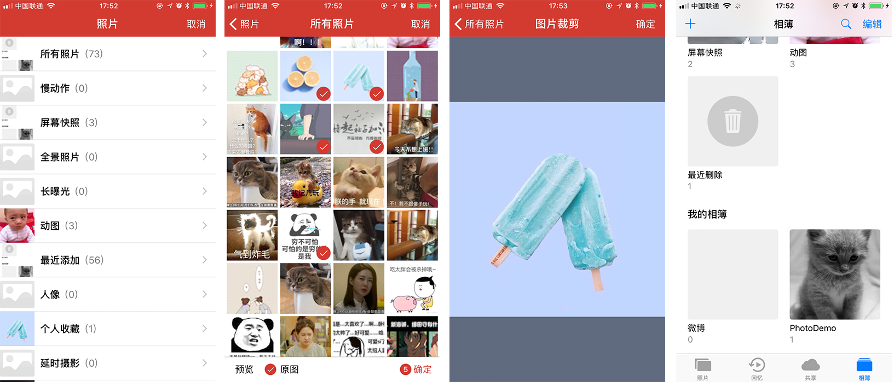

# MMPhotoPicker

[](https://raw.githubusercontent.com/dexianyinjiu/MMPhotoPicker/master/LICENSE)&nbsp;
[](http://cocoapods.org/pods/MMPhotoPicker)&nbsp;
[](http://cocoapods.org/pods/MMPhotoPicker)&nbsp;



`MMPhotoPicker`基于`Photos`框架，集成了图片选择器（支持多选、单选、对图片进行裁剪、选择原图、可预览）以及创建自定义相册，并保存图片到自定义相册。若想使用基于`AssetsLibrary`框架的图片选择器，点击[这里](https://github.com/CheeryLau/MMImagePicker)。


## 使用

1. `pod "MMPhotoPicker"` ;
2. `pod install` / `pod update`;
3. `#import <MMPhotoPicker/MMPhotoPickerController.h>`.

```objc
MMPhotoPickerController属性介绍：
   
// 主色调[默认蓝色]
@property (nonatomic, strong) UIColor *mainColor;
// 是否回传原图 [可用于控制图片压系数]
@property (nonatomic, assign) BOOL isOrigin;
// 是否显示原图选项 [默认NO]
@property (nonatomic, assign) BOOL showOriginImageOption;
// 是否显示空相册 [默认NO]
@property (nonatomic, assign) BOOL showEmptyAlbum;
// 是否只选取一张 [默认NO]
@property (nonatomic, assign) BOOL singleImageOption;
// 是否选取一张且需要裁剪 [默认NO]
@property (nonatomic, assign) BOOL cropImageOption;
// 裁剪的大小[默认方形、屏幕宽度]
@property (nonatomic, assign) CGSize imageCropSize;
// 最大选择数目[默认9张]
@property (nonatomic, assign) NSInteger maximumNumberOfImage;
// 代理
@property (nonatomic, assign) id<MMPhotoPickerDelegate> delegate;
```

  
### 图片选择

```objc
MMPhotoPickerController *mmVC = [[MMPhotoPickerController alloc] init];
mmVC.delegate = self;
mmVC.showEmptyAlbum = YES;
mmVC.maximumNumberOfImage = 9;
UINavigationController *mmNav = [[UINavigationController alloc] initWithRootViewController:mmVC];
[self.navigationController presentViewController:mmNav animated:YES completion:nil];
```

```objc
#pragma mark - MMPhotoPickerDelegate
- (void)mmPhotoPickerController:(MMPhotoPickerController *)picker didFinishPickingMediaWithInfo:(NSArray *)info
{
     NSLog(@"%@",info);
}

- (void)mmPhotoPickerControllerDidCancel:(MMPhotoPickerController *)picker
{
     NSLog(@"Cancel");
}
```

### 保存视频/图片到自定义相册

```objc
MMPhotoUtil类中：

// 图片
+ (void)writeImageToPhotoAlbum:(UIImage *)image;
// 视频
+ (void)writeVideoToPhotoAlbum:(NSURL *)videoURL;
```

## 注意

1. 需要在Info.plist中添加隐私授权：`Privacy - Photo Library Usage Description`

2. 相册列表要根据手机语言环境显示语言，需设置`Localized resources can be mixed` 为 `YES`


## END

有问题可以联系我【QQ:1539901764 要备注来源哦】，如果这个工具对你有些帮助，请给我一个star、watch。O(∩_∩)O谢谢


